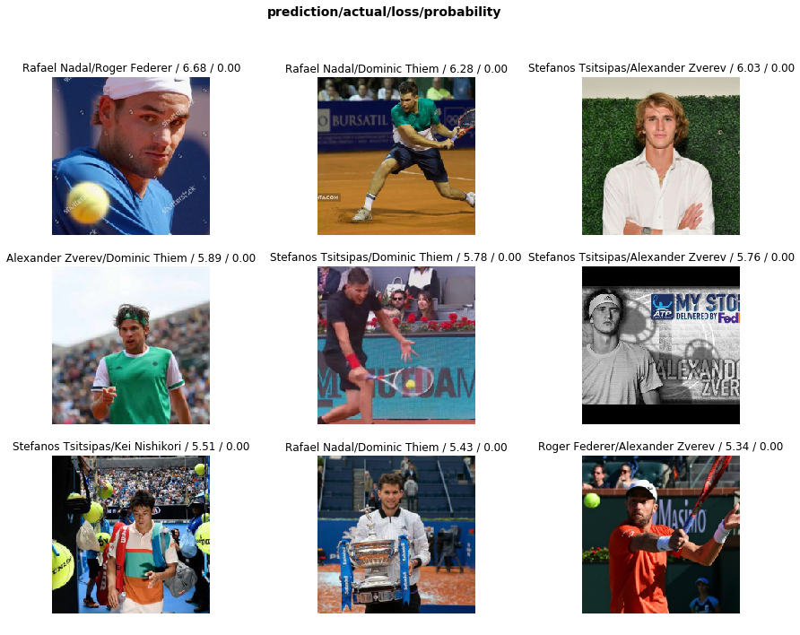

## Creating your own dataset from Google Images

*by: Francisco Ingham and Jeremy Howard. Inspired by [Adrian Rosebrock](https://www.pyimagesearch.com/2017/12/04/how-to-create-a-deep-learning-dataset-using-google-images/)*


```python
from fastai.vision import *
```

## Get a list of URLs

### Search and scroll


```python
# Novak Djokovic -"Rafael Nadal" -"Roger Federer" -"Dominic Thiem" -"Alexander Zverev" -"Stefanos Tsitsipas" -"Kei Nishikori" -"Andy Murray" -"Stan Wawrinka" -"Nick Kyrgios"  -"Serena Williams" -Other -Son -Daughter -Wife -Kid -Cartoon -Art -Woman -"Gael Monfils" -"Karen Khachanov" -"Auger Aliassime" -"Tommy Berdych" -"Marin Cilic" -Stats -Text -Blur -Girlfriend -Gamble -vs
# Rafael Nadal -"Novak Djokovic" -"Roger Federer" -"Dominic Thiem" -"Alexander Zverev" -"Stefanos Tsitsipas" -"Kei Nishikori" -"Andy Murray" -"Stan Wawrinka" -"Nick Kyrgios"  -"Serena Williams" -Other -Son -Daughter -Wife -Kid -Cartoon -Art -Woman -"Gael Monfils" -"Karen Khachanov" -"Auger Aliassime" -"Tommy Berdych" -"Marin Cilic" -Stats -Text -Blur -Girlfriend -Gamble -vs
# Roger Federer -"Rafael Nadal" -"Novak Djokovic" -"Dominic Thiem" -"Alexander Zverev" -"Stefanos Tsitsipas" -"Kei Nishikori" -"Andy Murray" -"Stan Wawrinka" -"Nick Kyrgios"  -"Serena Williams" -Other -Son -Daughter -Wife -Kid -Cartoon -Art -Woman -"Gael Monfils" -"Karen Khachanov" -"Auger Aliassime" -"Tommy Berdych" -"Marin Cilic" -Stats -Text -Blur -Girlfriend -Gamble -vs
# Dominic Thiem -"Rafael Nadal" -"Roger Federer" -"Novak Djokovic" -"Alexander Zverev" -"Stefanos Tsitsipas" -"Kei Nishikori" -"Andy Murray" -"Stan Wawrinka" -"Nick Kyrgios"  -"Serena Williams" -Other -Son -Daughter -Wife -Kid -Cartoon -Art -Woman -"Gael Monfils" -"Karen Khachanov" -"Auger Aliassime" -"Tommy Berdych" -"Marin Cilic" -Stats -Text -Blur -Girlfriend -Gamble -vs
# Alexander Zverev -"Rafael Nadal" -"Roger Federer" -"Dominic Thiem" -"Novak Djokovic" -"Stefanos Tsitsipas" -"Kei Nishikori" -"Andy Murray" -"Stan Wawrinka" -"Nick Kyrgios"  -"Serena Williams" -Other -Son -Daughter -Wife -Kid -Cartoon -Art -Woman -"Gael Monfils" -"Karen Khachanov" -"Auger Aliassime" -"Tommy Berdych" -"Marin Cilic" -Stats -Text -Blur -Girlfriend -Gamble -vs 
# Stefanos Tsitsipas -"Rafael Nadal" -"Roger Federer" -"Dominic Thiem" -"Alexander Zverev" -"Novak Djokovic" -"Kei Nishikori" -"Andy Murray" -"Stan Wawrinka" -"Nick Kyrgios"  -"Serena Williams" -Other -Son -Daughter -Wife -Kid -Cartoon -Art -Woman -"Gael Monfils" -"Karen Khachanov" -"Auger Aliassime" -"Tommy Berdych" -"Marin Cilic" -Stats -Text -Blur -Girlfriend -Gamble -vs
# Kei Nishikori -"Rafael Nadal" -"Roger Federer" -"Dominic Thiem" -"Alexander Zverev" -"Stefanos Tsitsipas" -"Novak Djokovic" -"Andy Murray" -"Stan Wawrinka" -"Nick Kyrgios"  -"Serena Williams" -Other -Son -Daughter -Wife -Kid -Cartoon -Art -Woman -"Gael Monfils" -"Karen Khachanov" -"Auger Aliassime" -"Tommy Berdych" -"Marin Cilic" -Stats -Text -Blur -Girlfriend -Gamble -vs
```

### Download into file

Press <kbd>Ctrl</kbd><kbd>Shift</kbd><kbd>J</kbd> in Windows/Linux and <kbd>Cmd</kbd><kbd>Opt</kbd><kbd>J</kbd> in Mac, and a small window the javascript 'Console' will appear. That is where you will paste the JavaScript commands.

You will need to get the urls of each of the images. Before running the following commands, you may want to disable ads block add-ons (YouBlock) in Chrome. Otherwise window.open() coomand doesn't work. Then you can run the following commands:

```javascript
urls = Array.from(document.querySelectorAll('.rg_di .rg_meta')).map(el=>JSON.parse(el.textContent).ou);
window.open('data:text/csv;charset=utf-8,' + escape(urls.join('\n')));
```

### Create directory and upload urls file into your server

Choose an appropriate name for your labeled images. You can run these steps multiple times to create different labels.


```python
folder = 'Novak Djokovic'
file = 'urls_novak_djokovic.csv'
```


```python
folder = 'Rafael Nadal'
file = 'urls_rafael_nadal.csv'
```


```python
folder = 'Roger Federer'
file = 'urls_roger_federer.csv'
```


```python
folder = 'Dominic Thiem'
file = 'urls_dominic_thiem.csv'
```


```python
folder = 'Alexander Zverev'
file = 'urls_alexander_zverev.csv'
```


```python
folder = 'Stefanos Tsitsipas'
file = 'urls_stefanos_tsitsipas.csv'
```


```python
folder = 'Kei Nishikori'
file = 'urls_kei_nishikori.csv'
```

You will need to run this cell once per each category.


```python
path = Path('data/atp top7')
dest = path/folder
dest.mkdir(parents=True, exist_ok=True)
```


```python
path.ls()
```


    [PosixPath('data/atp top7/urls_roger_federer.csv'),
     PosixPath('data/atp top7/urls_novak_djokovic.csv'),
     PosixPath('data/atp top7/Stefanos Tsitsipas'),
     PosixPath('data/atp top7/urls_kei_nishikori.csv'),
     PosixPath('data/atp top7/models'),
     PosixPath('data/atp top7/Dominic Thiem'),
     PosixPath('data/atp top7/.ipynb_checkpoints'),
     PosixPath('data/atp top7/urls_rafael_nadal.csv'),
     PosixPath('data/atp top7/urls_alexander_zverev.csv'),
     PosixPath('data/atp top7/Kei Nishikori'),
     PosixPath('data/atp top7/labels.csv'),
     PosixPath('data/atp top7/cleaned.csv'),
     PosixPath('data/atp top7/urls_stefanos_tsitsipas.csv'),
     PosixPath('data/atp top7/Roger Federer'),
     PosixPath('data/atp top7/Novak Djokovic'),
     PosixPath('data/atp top7/Rafael Nadal'),
     PosixPath('data/atp top7/Alexander Zverev'),
     PosixPath('data/atp top7/urls_dominic_thiem.csv')]


```python
classes = ['Novak Djokovic','Rafael Nadal','Roger Federer','Dominic Thiem','Alexander Zverev','Stefanos Tsitsipas','Kei Nishikori']
```


```python
download_images(path/file, dest, max_pics=250)
```


```python
# If you have problems download, try with `max_workers=0` to see exceptions:
# download_images(path/file, dest, max_pics=20, max_workers=0)
```

Then we can remove any images that can't be opened:


```python
for c in classes:
    print(c)
    verify_images(path/c, delete=True, max_size=500)
```

## View data


```python
np.random.seed(42)
data = ImageDataBunch.from_folder(path, train=".", valid_pct=0.2,
        ds_tfms=get_transforms(), size=224, num_workers=4).normalize(imagenet_stats)
```


```python
# If you already cleaned your data, run this cell instead of the one before
# np.random.seed(42)
# data = ImageDataBunch.from_csv(path, folder=".", valid_pct=0.2, csv_labels='cleaned.csv',
#         ds_tfms=get_transforms(), size=224, num_workers=4).normalize(imagenet_stats)
```

Good! Let's take a look at some of our pictures then.


```python
data.classes
```


    ['Alexander Zverev',
     'Dominic Thiem',
     'Kei Nishikori',
     'Novak Djokovic',
     'Rafael Nadal',
     'Roger Federer',
     'Stefanos Tsitsipas']


```python
data.show_batch(rows=3, figsize=(7,8))
```


```python
data.classes, data.c, len(data.train_ds), len(data.valid_ds)
#db.classes, db.c, len(db.train_ds), len(db.valid_ds)
```


    (['Alexander Zverev',
      'Dominic Thiem',
      'Kei Nishikori',
      'Novak Djokovic',
      'Rafael Nadal',
      'Roger Federer',
      'Stefanos Tsitsipas'],
     7,
     1286,
     321)


## Train model


```python
learn = cnn_learner(data, models.resnet34, metrics=error_rate)
```


```python
learn.fit_one_cycle(14)
```


<table border="1" class="dataframe">
  <thead>
    <tr style="text-align: left;">
      <th>epoch</th>
      <th>train_loss</th>
      <th>valid_loss</th>
      <th>error_rate</th>
      <th>time</th>
    </tr>
  </thead>
  <tbody>
    <tr>
      <td>0</td>
      <td>0.381946</td>
      <td>1.190612</td>
      <td>0.417445</td>
      <td>00:07</td>
    </tr>
    <tr>
      <td>1</td>
      <td>0.384628</td>
      <td>1.217562</td>
      <td>0.414330</td>
      <td>00:07</td>
    </tr>
    <tr>
      <td>2</td>
      <td>0.400694</td>
      <td>1.195628</td>
      <td>0.398754</td>
      <td>00:08</td>
    </tr>
    <tr>
      <td>3</td>
      <td>0.410511</td>
      <td>1.227112</td>
      <td>0.420561</td>
      <td>00:08</td>
    </tr>
    <tr>
      <td>4</td>
      <td>0.414784</td>
      <td>1.231365</td>
      <td>0.389408</td>
      <td>00:07</td>
    </tr>
    <tr>
      <td>5</td>
      <td>0.427446</td>
      <td>1.207300</td>
      <td>0.408100</td>
      <td>00:08</td>
    </tr>
    <tr>
      <td>6</td>
      <td>0.435251</td>
      <td>1.258277</td>
      <td>0.401869</td>
      <td>00:07</td>
    </tr>
    <tr>
      <td>7</td>
      <td>0.427504</td>
      <td>1.228777</td>
      <td>0.380062</td>
      <td>00:07</td>
    </tr>
    <tr>
      <td>8</td>
      <td>0.415793</td>
      <td>1.200027</td>
      <td>0.383178</td>
      <td>00:08</td>
    </tr>
    <tr>
      <td>9</td>
      <td>0.398905</td>
      <td>1.184260</td>
      <td>0.383178</td>
      <td>00:07</td>
    </tr>
    <tr>
      <td>10</td>
      <td>0.381368</td>
      <td>1.161355</td>
      <td>0.364486</td>
      <td>00:07</td>
    </tr>
    <tr>
      <td>11</td>
      <td>0.365940</td>
      <td>1.164675</td>
      <td>0.373832</td>
      <td>00:08</td>
    </tr>
    <tr>
      <td>12</td>
      <td>0.358041</td>
      <td>1.168766</td>
      <td>0.364486</td>
      <td>00:08</td>
    </tr>
    <tr>
      <td>13</td>
      <td>0.340414</td>
      <td>1.164816</td>
      <td>0.367601</td>
      <td>00:08</td>
    </tr>
  </tbody>
</table>


```python
learn.save('stage-1')
```


```python
learn.unfreeze()
```


```python
learn.lr_find()
```


    LR Finder is complete, type {learner_name}.recorder.plot() to see the graph.


```python
learn.recorder.plot()
```


```python
# Choose the rigion of maximum downward slope on LR curve
learn.fit_one_cycle(2, max_lr=slice(2*1e-5,3*1e-4))
```


<table border="1" class="dataframe">
  <thead>
    <tr style="text-align: left;">
      <th>epoch</th>
      <th>train_loss</th>
      <th>valid_loss</th>
      <th>error_rate</th>
      <th>time</th>
    </tr>
  </thead>
  <tbody>
    <tr>
      <td>0</td>
      <td>0.270985</td>
      <td>1.137047</td>
      <td>0.361371</td>
      <td>00:09</td>
    </tr>
    <tr>
      <td>1</td>
      <td>0.238899</td>
      <td>1.106891</td>
      <td>0.367601</td>
      <td>00:09</td>
    </tr>
  </tbody>
</table>


```python
learn.save('stage-2')
```

## Interpretation


```python
learn.load('stage-2');
```


```python
interp = ClassificationInterpretation.from_learner(learn)
#interp = ClassificationInterpretation.from_learner(learn_cln)
```


```python
interp.plot_confusion_matrix()
```


```python
losses,idxs = interp.top_losses()
interp.plot_top_losses(9, figsize=(15,11), heatmap=False)
```





## Cleaning Up

Some of our top losses aren't due to bad performance by our model. There are images in our data set that shouldn't be.

Using the `ImageCleaner` widget from `fastai.widgets` we can prune our top losses, removing photos that don't belong.


```python
from fastai.widgets import *
```

First we need to get the file paths from our top_losses. We can do this with `.from_toplosses`. We then feed the top losses indexes and corresponding dataset to `ImageCleaner`.

Notice that the widget will not delete images directly from disk but it will create a new csv file `cleaned.csv` from where you can create a new ImageDataBunch with the corrected labels to continue training your model.

In order to clean the entire set of images, we need to create a new dataset without the split. The video lecture demostrated the use of the `ds_type` param which no longer has any effect. See [the thread](https://forums.fast.ai/t/duplicate-widget/30975/10) for more details.


```python
#db = (ImageList.from_folder(path)
#                   .no_split()
#                   .label_from_folder()
#                   .transform(get_transforms(), size=224)
#                   .databunch()
#     )
```


```python
#If you already cleaned your data using indexes from `from_toplosses`,
#run this cell instead of the one before to proceed with removing duplicates.
#Otherwise all the results of the previous step would be overwritten by
#the new run of `ImageCleaner`
#db = (ImageList.from_csv(path, 'cleaned.csv', folder='.')
#                   .no_split()
#                   .label_from_df()
#                   .transform(get_transforms(), size=224)
#                   .databunch()
#     )
```


```python
import pandas as pd
clean_data = pd.read_csv(path/'cleaned.csv') 
clean_data.to_csv(path/'labels.csv', index=False)
```


```python
db = ImageDataBunch.from_csv(path, header='infer', size=224, valid_pct = 0.2);
```


```python
#doc(ImageList.from_csv)
```


```python
learn_cln = cnn_learner(db, models.resnet34, metrics=error_rate)
learn_cln.load('stage-2');
learn_cln.fit_one_cycle(4)
```


<table border="1" class="dataframe">
  <thead>
    <tr style="text-align: left;">
      <th>epoch</th>
      <th>train_loss</th>
      <th>valid_loss</th>
      <th>error_rate</th>
      <th>time</th>
    </tr>
  </thead>
  <tbody>
    <tr>
      <td>0</td>
      <td>0.122131</td>
      <td>0.169370</td>
      <td>0.045455</td>
      <td>00:06</td>
    </tr>
    <tr>
      <td>1</td>
      <td>0.093082</td>
      <td>0.038698</td>
      <td>0.012397</td>
      <td>00:06</td>
    </tr>
    <tr>
      <td>2</td>
      <td>0.077548</td>
      <td>0.029944</td>
      <td>0.008264</td>
      <td>00:06</td>
    </tr>
    <tr>
      <td>3</td>
      <td>0.073649</td>
      <td>0.029345</td>
      <td>0.004132</td>
      <td>00:06</td>
    </tr>
  </tbody>
</table>


```python
learn_cln.save('stage-3')
```


```python
interp = ClassificationInterpretation.from_learner(learn_cln)
#interp.plot_confusion_matrix()
```


```python
from pylab import rcParams
rcParams['figure.figsize'] = 7, 14
interp.plot_confusion_matrix()
```


```python
interp.plot_top_losses(9, figsize=(15,11), heatmap=False)
```


```python
interp.plot_top_losses(9, figsize=(15,11), heatmap=False, largest=False)
# Jump to next section once we have the final model from Stage-3
```


```python
#doc(ImageList.from_csv)
learn.load('stage-2');
interp = ClassificationInterpretation.from_learner(learn)
interp.plot_confusion_matrix()
```


```python
losses,idxs = interp.top_losses()
interp.plot_top_losses(9, figsize=(15,11), heatmap=False)
```


Then we create a new learner to use our new databunch with all the images.


```python
ds, idxs = DatasetFormatter().from_toplosses(learn)
```

Make sure you're running this notebook in Jupyter Notebook, not Jupyter Lab. That is accessible via [/tree](/tree), not [/lab](/lab). Running the `ImageCleaner` widget in Jupyter Lab is [not currently supported](https://github.com/fastai/fastai/issues/1539).


```python
ImageCleaner(ds, idxs, path)
# Go back and recreate databunch
```


    HBox(children=(VBox(children=(Image(value=b'\xff\xd8\xff\xe0\x00\x10JFIF\x00\x01\x01\x01\x00d\x00d\x00\x00\xff…


    Button(button_style='primary', description='Next Batch', layout=Layout(width='auto'), style=ButtonStyle())


Flag photos for deletion by clicking 'Delete'. Then click 'Next Batch' to delete flagged photos and keep the rest in that row. `ImageCleaner` will show you a new row of images until there are no more to show. In this case, the widget will show you images until there are none left from `top_losses.ImageCleaner(ds, idxs)`

You can also find duplicates in your dataset and delete them! To do this, you need to run `.from_similars` to get the potential duplicates' ids and then run `ImageCleaner` with `duplicates=True`. The API works in a similar way as with misclassified images: just choose the ones you want to delete and click 'Next Batch' until there are no more images left.

Make sure to recreate the databunch and `learn_cln` from the `cleaned.csv` file. Otherwise the file would be overwritten from scratch, loosing all the results from cleaning the data from toplosses.


```python
ds, idxs = DatasetFormatter().from_similars(learn)
```

    Getting activations...


    <div>
        <style>
            /* Turns off some styling */
            progress {
                /* gets rid of default border in Firefox and Opera. */
                border: none;
                /* Needs to be in here for Safari polyfill so background images work as expected. */
                background-size: auto;
            }
            .progress-bar-interrupted, .progress-bar-interrupted::-webkit-progress-bar {
                background: #F44336;
            }
        </style>
      <progress value='21' class='' max='21', style='width:300px; height:20px; vertical-align: middle;'></progress>
      100.00% [21/21 00:05<00:00]
    </div>
    


    Computing similarities...


```python
ImageCleaner(ds, idxs, path, duplicates=True)
# Go back and recreate databunch
```


    HBox(children=(VBox(children=(Image(value=b'\xff\xd8\xff\xe0\x00\x10JFIF\x00\x01\x01\x01\x00d\x00d\x00\x00\xff…


    Button(button_style='primary', description='Next Batch', layout=Layout(width='auto'), style=ButtonStyle())


Remember to recreate your ImageDataBunch from your `cleaned.csv` to include the changes you made in your data!

## Putting your model in production

First thing first, let's export the content of our `Learner` object for production:


```python
learn_cln.export()
```

This will create a file named 'export.pkl' in the directory where we were working that contains everything we need to deploy our model (the model, the weights but also some metadata like the classes or the transforms/normalization used).

You probably want to use CPU for inference, except at massive scale (and you almost certainly don't need to train in real-time). If you don't have a GPU that happens automatically. You can test your model on CPU like so:


```python
defaults.device = torch.device('cpu')
```


```python
img = open_image(path/'Stefanos Tsitsipas'/'00000006.jpg')
img
```


We create our `Learner` in production enviromnent like this, jsut make sure that `path` contains the file 'export.pkl' from before.


```python
learn = load_learner(path)
```


```python
pred_class,pred_idx,outputs = learn.predict(img)
pred_class
```


    Category Stefanos Tsitsipas


So you might create a route something like this ([thanks](https://github.com/simonw/cougar-or-not) to Simon Willison for the structure of this code):

```python
@app.route("/classify-url", methods=["GET"])
async def classify_url(request):
    bytes = await get_bytes(request.query_params["url"])
    img = open_image(BytesIO(bytes))
    _,_,losses = learner.predict(img)
    return JSONResponse({
        "predictions": sorted(
            zip(cat_learner.data.classes, map(float, losses)),
            key=lambda p: p[1],
            reverse=True
        )
    })
```

(This example is for the [Starlette](https://www.starlette.io/) web app toolkit.)
